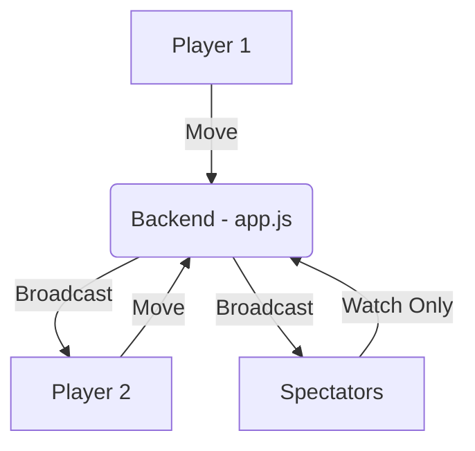

# ♟️ Chess Project Backend

A real-time multiplayer **chess backend** built with **Node.js**, **Express**, and **Socket.IO**.  
This backend manages chess game state, validates moves, and enables live play between players.

---

## 🚀 Features

- **Game State Management** – Tracks board positions and enforces chess rules using [chess.js](https://github.com/jhlywa/chess.js).
- **Real-Time Communication** – Low-latency gameplay via WebSockets (Socket.IO).
- **Player Handling** – Supports players and spectators with turn-based logic.
- **Extensible API** – Can integrate with any frontend client (React, Angular, Vanilla JS, etc.).
- **Static Assets** – Serves frontend files via Express (`public/`, `views/`).

---

## 📂 Project Structure
```
├── app.js # Main backend server
├── package.json # Dependencies and scripts
├── package-lock.json
├── backendSetup.yaml # Backend setup guide
├── frontendSetup.yaml # Frontend setup guide
├── .gitignore # Ignore node_modules, env, logs
├── public/
│ └── js/ # Frontend JavaScript
└── views/ # EJS templates for UI
```
## ⚙️ Installation

### Prerequisites
- [Node.js](https://nodejs.org/) (v14+ recommended)
- npm (comes with Node.js)

### Steps
```bash
# Clone this repository
git clone https://github.com/Gautam-Kakkar/Chess-Project.git
cd Chess-Project

# Install dependencies
npm install
```
▶️ Running the Server
```bash
# Start the backend server
npm start
```

By default, the server runs at:
👉 http://localhost:3000

## 🔄 Game Flow


